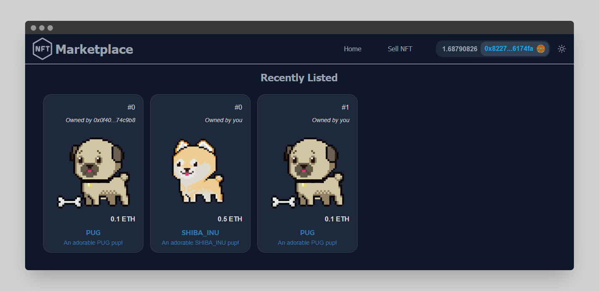

<h1 align="center">
    TheGraph NFT Marketplace
</h1>

<br/>

<p align="center">

</a>
</p>

<br/>

This is a repo showing how to make an NFT Marketplace from scratch!

<hr/>
 
## 🛠️&nbsp; How to run

1. Install Subgraph CLI

   ```
   yarn global add @graphprotocol/graph-cli
   ```

2. Log into [the graph UI](https://thegraph.com/studio/subgraph) and create a new Subgraph.

   Use Goerli as the network.

3. Initialize Subgraph

   ```
   graph init --studio nft-marketplace
   ```

4. Authenticate CLI

   ```
   graph auth  --studio YOUR_DEPLOY_KEY_HERE
   ```

5. Update your `subgraph.yaml`

   - Update the `address` with your NftMarketplace Address
   - Update the `startBlock` with the block right before your contract was deployed

6. Build graph locally

   ```
   graph codegen && graph build
   ```

   - `graph codegen`: Generates code in the `generated` folder based on your `schema.graphql`
   - `graph build`: Generates the build that will be uploaded to the graph

7. Deploy subgraph

   Replace `VERSION_NUMBER_HERE` with a version number like `0.0.1`.

   ```
   graph deploy --studio nft-marketplace -l VERSION_NUMBER_HERE
   ```

8. View your UI

   Back in your hardhat project, mint and list an NFT with:

   ```
   yarn hardhat run scripts/mint-and-list-item.js --network goerli
   ```

## 🏴‍☠️&nbsp; Other Parts

You can find the backend part in [this repository](https://github.com/Meno96/nft-marketplace-hardhat.git)

and the frontend part in [this repository](https://github.com/Meno96/nft-marketplace-nextjs.git)

## 📫&nbsp; Have a question? Want to chat?

[LinkedIn](https://www.linkedin.com/in/daniele-menin/)

[Instagram](https://www.instagram.com/danielemeno96/)
